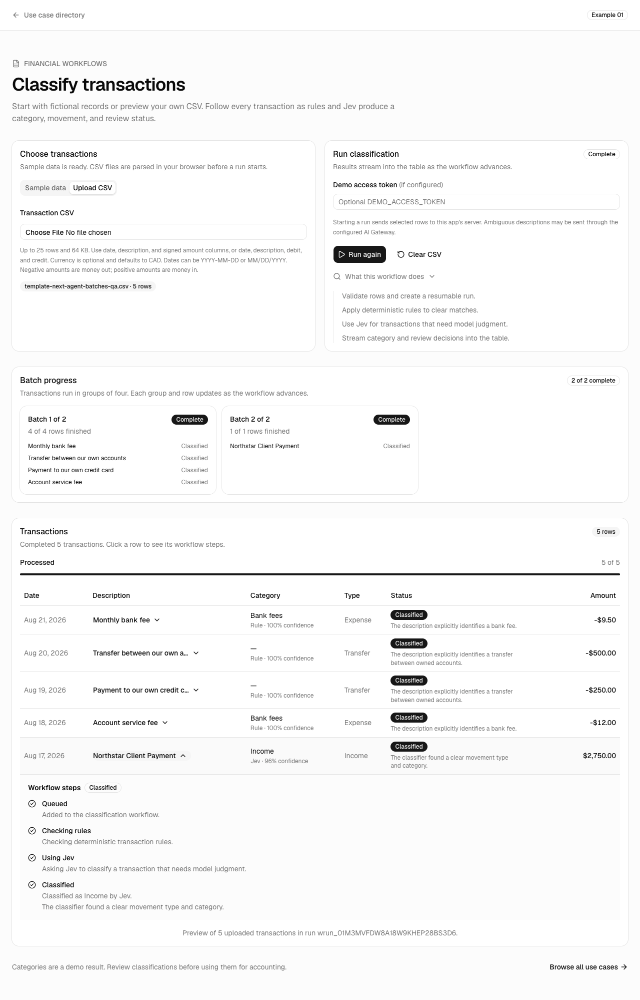
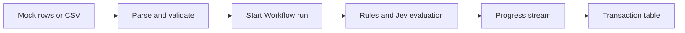

# template-next-agent

An open source Next.js starter for small AI workflows. The home page is a directory of sample projects. The first sample, **Transaction classification**, lets you select synthetic transactions or upload a CSV, run a TypeSafe Jev classification workflow, and watch each row move through its processing states.

This repository was created with `create-next-app` and uses Bun, Next.js 16, React 19, shadcn/ui, AI Elements, AI SDK 7, Vercel AI Gateway, EVE, and Workflow SDK 5. It also includes optional Supabase client helpers for future use cases. It is a learning and extension template, with real Jev calls when configured. Synthetic inputs are provided for the first run.

## Quick start

Install Node.js 24 and [Bun](https://bun.sh/docs/installation), then run:

```bash
git clone https://github.com/trancethehuman/template-next-agent.git
cd template-next-agent
bun install
cp .env.local.example .env.local
```

Open `.env.local` and fill in `AI_GATEWAY_API_KEY` with your own [Vercel AI Gateway key](https://vercel.com/docs/ai-gateway). Do not put the key in `NEXT_PUBLIC_*` variables. The file is ignored by Git; `.env.local.example` contains names and guidance only. An agent setting up this repo should create the local file from the example, identify missing variable names, and ask the operator to enter the values directly. Never copy credentials from a different repository or commit a populated file.

```bash
bun run dev
```

Open [http://localhost:3000](http://localhost:3000). Select **Transaction classification** from the directory or go directly to [http://localhost:3000/transactions](http://localhost:3000/transactions). Select individual synthetic transactions or upload a CSV, then start classification. AI Gateway authentication is required for live Jev decisions.

## Preview



The screenshot uses synthetic transactions.

## Environment

| Variable | Local | Vercel | Purpose |
| --- | --- | --- | --- |
| `AI_GATEWAY_API_KEY` | Set for live model calls | Optional if project OIDC is enabled | Authenticates Jev and EVE model calls through AI Gateway. |
| `WORKFLOW_LOCAL_HEADERS_TIMEOUT_MS` | Keep the example value `90000` | Not needed | Gives the local Workflow queue time for slower Jev responses without replaying steps. Restart `bun run dev` after changing it. |
| `DEMO_ACCESS_TOKEN` | Optional for local-only use | Required for an internet-facing demo | Bearer token for protected classification routes. Use a long random value and keep it server-side. |
| `NEXT_PUBLIC_SUPABASE_URL` | Optional | Optional | Your own Supabase project URL for future features. |
| `NEXT_PUBLIC_SUPABASE_PUBLISHABLE_KEY` | Optional | Optional | Browser-safe publishable key for that project. Set together with the URL. |

On Vercel, [project OIDC](https://vercel.com/docs/oidc) can authenticate AI Gateway calls without a static API key. Link the project and use `bunx vercel@59.9.1 env pull .env.local` when developing with OIDC; its token is short lived and must be refreshed. The pull can replace the existing local file, so inspect the resulting variable names and restore any separate local settings. Keep `.env.local` out of Git. The production access token remains a separate setting.

## How the sample works



CSV parsing, row limits, amounts, and dates are handled in application code. Jev receives a structured transaction and a closed set of classification choices; it is not used to parse the CSV. Workflow SDK persists and resumes processing steps and emits row-level and batch progress. Runs process up to four rows per batch. Click a transaction to inspect its live step history. The table distinguishes classified rows, rows that need review, and failed rows. Sample transactions are synthetic. The app does not post accounting entries or move money.

The browser retries a dropped progress connection up to three times, resuming from the last event index. The Workflow run continues when a connection drops. Reloading the page resets the current table and run selection in this starter.

The EVE example assistant is a separate, protected agent that explains the demo. It does not classify transactions; the application workflow and Jev perform that work. Its source is under `agent/` and it can be explored locally with `bun run dev:eve`.

| Area | Location |
| --- | --- |
| Directory and sample page | `app/page.tsx`, `app/transactions/` |
| CSV and transaction shape | `lib/transactions/` |
| Optional Supabase clients | `lib/supabase/` |
| Rules and Jev judgment | `lib/classification/` |
| Durable processing | `workflows/` |
| EVE agent | `agent/` |
| shadcn and AI Elements source | `components/ui/`, `components/ai-elements/` |
| Agent guidance | `AGENTS.md`, `skills/` |

The exact supported CSV headers and limits are documented in [docs/CSV.md](docs/CSV.md). The sample does not require a bank connection or access to another application's data.

Supabase is optional and is not used to save or classify transactions. The starter includes browser and server client helpers but no project, database schema, migration, or Auth flow. To use it for a new sample, see [docs/SUPABASE.md](docs/SUPABASE.md).

See [docs/ARCHITECTURE.md](docs/ARCHITECTURE.md) for the separate responsibilities of Jev, EVE, and Workflow SDK.

## Commands

Use Bun for the project:

| Command | Purpose |
| --- | --- |
| `bun run dev` | Run Next.js and the integrated development services. |
| `bun run dev:eve` | Run the EVE agent development interface. |
| `bun run test` | Run tests. |
| `bun run lint` | Run code lint. |
| `bun run lint:design` | Run the design and shadcn lint checks. |
| `bun run typecheck` | Check TypeScript. |
| `bun run build` | Build the Next.js application. |
| `bun run build:eve` | Build the example EVE agent locally. |
| `bun run build:vercel` | Assemble Vercel output after linking a project. |

The project pins versions in `package.json` and `bun.lock`, including Workflow SDK `5.0.0-beta.55`. Run `bun install` after cloning. An unversioned `bun add workflow` currently selects the older 4.x line, so change that pin only alongside the installed Workflow docs and a full build.

## Deploying on Vercel

1. Fork or use this repository as a GitHub template, then import it into Vercel as a Next.js project. Keep the Bun lockfile and use the repository build command.
2. Enable AI Gateway for the Vercel project. Use project OIDC or add `AI_GATEWAY_API_KEY` in Vercel project environment settings.
3. Add a long random `DEMO_ACCESS_TOKEN` to every environment where people can start or inspect classification runs. Enter that same token in the demo page's password field when testing the deployed UI.
4. If a future feature uses Supabase, add its project URL and publishable key to that environment. The transaction demo needs neither value.
5. Deploy, then verify the generated EVE and Workflow routes, a synthetic classification run, streamed row updates, and the terminal state. A successful build alone does not establish that the model or workflow ran.

For CLI setup, run `bunx vercel@59.9.1 login`, `bunx vercel@59.9.1 link`, and then `bun run build:vercel`. Vercel's Workflow World is used on Vercel; local development uses the local World. Review [docs/SECURITY.md](docs/SECURITY.md) before opening a public instance to other users.

## Agent skills and source docs

Portable agent skills are versioned under [`skills/`](skills/README.md). Most are complete upstream folders; two are original link guides because their upstream redistribution terms were unclear. `.agents/skills` is a relative symlink to the same directory for coding-agent discovery. Use the relevant skill before editing an integration, then verify APIs against the installed package documentation:

- `node_modules/next/dist/docs/`
- `node_modules/ai/docs/`
- `node_modules/eve/docs/README.md`
- `node_modules/workflow/docs/`

Skills and project instructions are guidance, while the lockfile and installed documentation define the actual API versions. Third-party attribution and licenses are in [THIRD_PARTY_NOTICES.md](THIRD_PARTY_NOTICES.md).

## License

Original project code and documentation are licensed under [AGPL-3.0](LICENSE). Copied third-party skills retain their own notices and terms as described in [THIRD_PARTY_NOTICES.md](THIRD_PARTY_NOTICES.md).

To propose changes, see [docs/CONTRIBUTING.md](docs/CONTRIBUTING.md).
